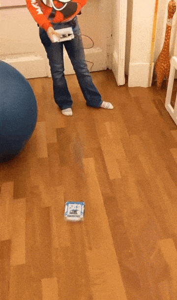

# Alvik remote controller


A simple motion-based remote controller for the Arduino Alvik robot. 

Unlike traditional remote controllers which are using buttons or joysticks,
this one is using the Arduino Nano RP2040 Connect built-in IMU (Inertial Measurement Unit) to drive Alvik. 

Based on how you tilt the controller, Alvik will move accordingly. 
For example, if you tilt the controller forward, Alvik will move forward, 
when you tilt the controller on the right, Alvik will turn right. 

## How to build it

### 1. Install MicroPython

Both the Arduino boards used in this project - the Arduino Nano ESP32 on Alvik, and the Arduino Nano RP2040 Connect on the controller -
are programmed with MicroPython. This means that you have to install the MicroPython interpreter on them.

The easier and recommended way to do it is to use the Arduino MicroPython Installer available at 
[https://labs.arduino.cc/en/labs/micropython-installer](https://labs.arduino.cc/en/labs/micropython-installer)

1. Download and install on your computer the MicroPython installer from the page above

2. Connect the Arduino Nano ESP32 with a USB-C cable as shown in this picture
   

3. Open the MicroPython Installer and wait until the Arduino Nano ESP32 is detected, then 
  click on the "Install MicroPython" button and wait until the process completes

4. Repeat steps 1-3 for the Arduino Nano RP2040 Connect

5. Now you should be ready to start programming your boards

Alternative ways to install MicroPython on these two boards are avalable on the [MicroPython site](https://micropython.org),
specifically the [Arduino Nano ESP32 page](https://micropython.org/download/ARDUINO_NANO_ESP32/)
and the [Arduino Nano RP2040 Connect page](https://micropython.org/download/ARDUINO_NANO_RP2040_CONNECT/).

### 2. Start programming in MicroPython

1. Download and install the Arduino Lab for MicroPython 
  from [https://labs.arduino.cc/en/labs/micropython](https://labs.arduino.cc/en/labs/micropython).
  The Arduino Lab for MicroPython is an IDE (Integrated Development Environment) you can
  use to easily program your Arduino boards.

2. Clone this git repository on your machine with the command:

    ```sh
    git clone https://github.com/csarnataro/alvik_remote_controller
    ```

3. Choose the `alvik_remote_controller` folder from the right panel of the Arduino Lab for MicroPython.
    We will start programming the remote controller, so change directory into `remote_controller` folder.
    There should be a couple of files there, namely `main.py` and `imu_controller_ble.py`


4. Click on the `Connect` button on the top left corner of the IDE and select your boards, as shown here:
    

5. Once the board is connected, copy all files from your computer (panel on the right) to the Arduino Nano RP2040 (panel on the left).
    The result should be similar to this:
    

    Reset your board using the small white botton near the USB port. A new automatically genereted file named `ble_secrets.json` 
    has been created by `aioble` module. This is expected, it's a how `aioble` stores and manages BLE related secret keys.

6. Repeat steps 3-5 for the Arduino Nano ESP32 board, only choose the `alvik` folder this time.

### 3. Have fun

If everything is working as expected, you should be able to turn you Alvik on and make it run like this:




### Technical details


The controller is built with an Arduino Nano RP2040 Connect, and it's leveraging 
the built-in IMU and the BlueTooth module (BLE) available on it. 

Both Alvik and the controller are programmed in MicroPython. 

A buzzer will play a melody each time the red button is pushed.

## Features: 
- control Alvik just by tilting the controller back/forward and left/right 
- it stops when it loose connection with the remote controller 
- a buzzer (a ModuinoBuzzer module, actually) will play a melody each time the red button is pushed.
- when the yellow button is pushed, some light effects are created on the ModulinoPixels module

Open points: 
- implement automatic reconnection to bluetooth 
- stop when an obstacle is detected
